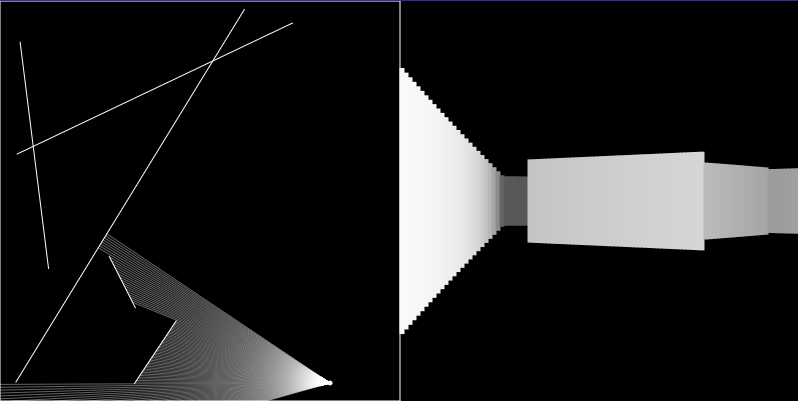

# 3D p5.js Raycasting

Few years ago, I tried to create a [basic raycasting engine in Ruby](https://github.com/TEDDAC/ruby-raycasting). It's very UGLY. The render algorithm can only make wireframe view. So I wanted to know how to create a clean raycasting.

It's easy to learn with the [tutorial](https://www.youtube.com/watch?v=vYgIKn7iDH8) by [Coding Train](https://www.youtube.com/@TheCodingTrain).

But his algorithm has artefact: fisheye effect. I also wanted to change the resolution. So, I modified the algo to fix it.

You can play with it [here](https://teddac.github.io/js-raycasting/).

